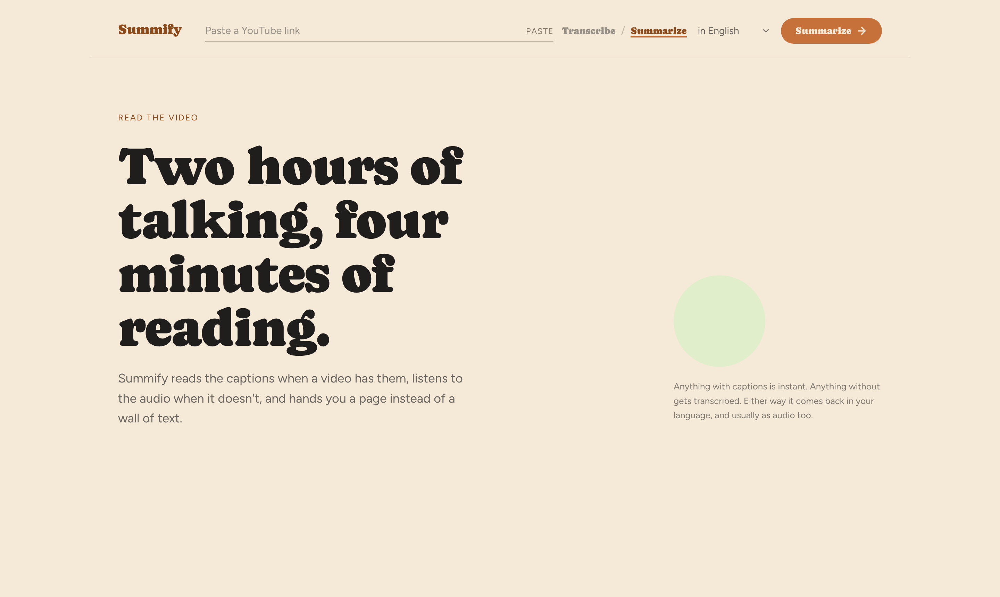
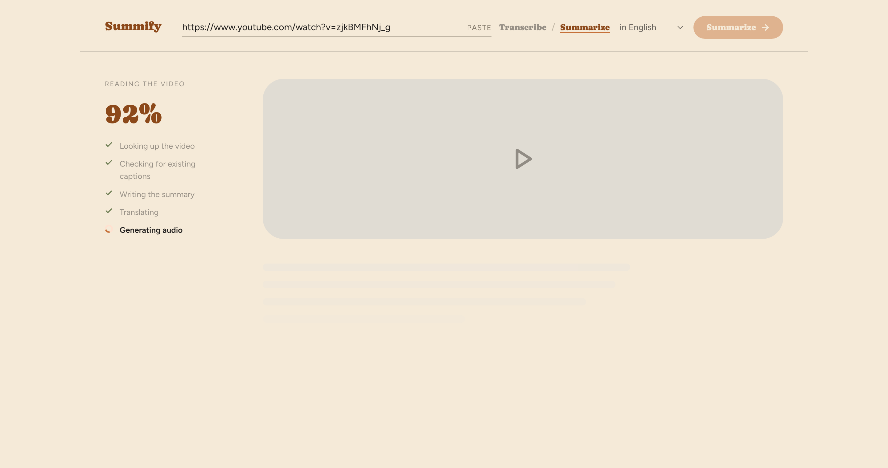
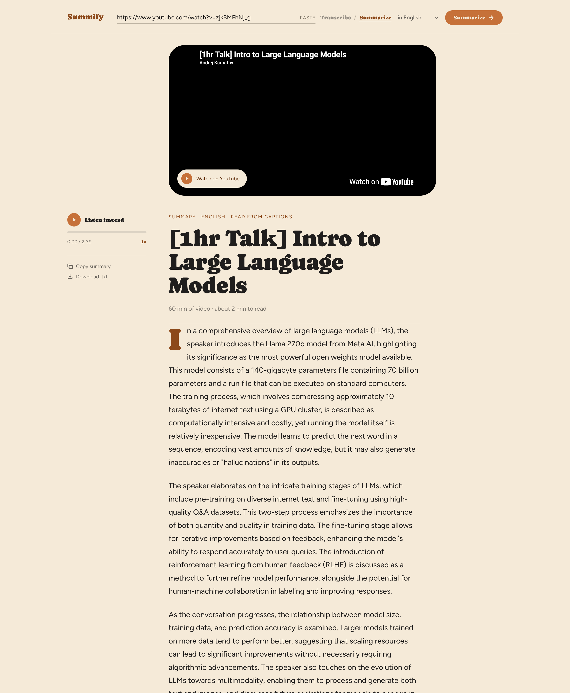

# YouTubeSummarizer

A web app for transcribing, summarizing, and translating YouTube videos globally.

Paste a YouTube URL, pick Transcribe or Summarize and a target language, and the
app returns the text plus an audio reading of it.

## How it works

1. **Text.** If the video has a caption track, the app uses it — that is free,
   instant, and usually more accurate than running speech recognition. Only when
   there are no captions does it download the audio and transcribe it with
   Whisper.
2. **Summary.** In Summarize mode the transcript goes to an OpenAI chat model.
   Long transcripts are summarized in pieces and those summaries are merged, so
   the whole video is covered rather than just the opening minutes.
3. **Translation.** Google Cloud Translate renders the result into the chosen
   language. If the text is already in that language the step is skipped.
4. **Audio.** OpenAI text-to-speech reads the result back.

Because a video takes minutes to process, the browser submits a job and polls
for progress instead of holding one long request open.

## Setup

Requires Python 3.11 or newer (yt-dlp has deprecated 3.10).

```bash
git clone https://github.com/JODGEW/YouTubeSummarizer.git
cd YouTubeSummarizer

python3 -m venv .venv
source .venv/bin/activate        # Windows: .venv\Scripts\activate
pip install -r requirements.txt

cp .env.example .env             # then fill in your keys
```

You need two credentials, both read from `.env` (which is gitignored — never
commit keys):

- `OPENAI_API_KEY` — from <https://platform.openai.com>, used for speech
  recognition, summaries and generated audio.
- `GOOGLE_APPLICATION_CREDENTIALS` — the absolute path to a
  [Google Cloud service-account key](https://cloud.google.com/translate) with
  the Translation API enabled.

**ffmpeg is optional.** Everything works without it. Install it only if you want
to transcribe videos whose audio exceeds the upload limit — with ffmpeg the app
compresses and splits the audio automatically instead of reporting an error.

## Running

```bash
python app.py
```

Then open <http://127.0.0.1:5000>.

`FLASK_DEBUG` is off by default and should stay off anywhere reachable from a
network: Flask's debugger is an interactive Python console for anyone who can
load an error page. `HOST` and `PORT` are also configurable via the environment.

## Configuration

Everything below is optional; see `.env.example` for the full list.

| Variable | Default | Purpose |
| --- | --- | --- |
| `SUMMARY_MODEL` | `gpt-4o-mini` | Model used for summaries |
| `ASR_BACKEND` | `openai` | `openai` calls the hosted API; `local` runs Whisper on this machine |
| `LOCAL_ASR_MODEL` | `base` | faster-whisper model size when `ASR_BACKEND=local` |
| `MAX_VIDEO_SECONDS` | `10800` | Refuse videos longer than this |
| `TTS_MAX_CHARS` | `20000` | Skip audio generation past this length |
| `MAX_CONCURRENT_JOBS` | `2` | Videos processed at once |
| `JOB_TTL_SECONDS` | `3600` | How long finished jobs and their audio are kept |

To run speech recognition locally instead of calling the hosted API:

```bash
pip install -r requirements-local-asr.txt
# then set ASR_BACKEND=local in .env
```

## API

The browser uses these; they are also usable directly.

- `POST /api/summarize` with `{"video_url": ..., "mode": "transcribe"|"summarize",
  "language": "en"}` returns `202 {"job_id": ...}`.
- `GET /api/jobs/<job_id>` returns the job's `status`, `stage_label`, `progress`,
  and once finished either `result` or `error`.
- `GET /media/<file>.mp3` serves generated audio.

Jobs live in the memory of a single process, so this runs as one worker. A
multi-worker deployment would need shared job state (Redis or a database).

## Screenshots

From a real run: Andrej Karpathy's one-hour LLM talk, summarized from its
caption track and read back as generated audio.






